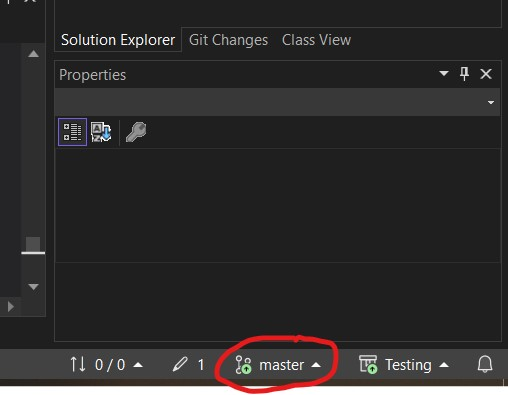
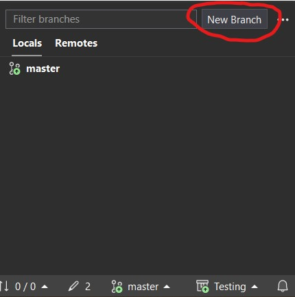
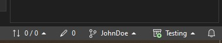
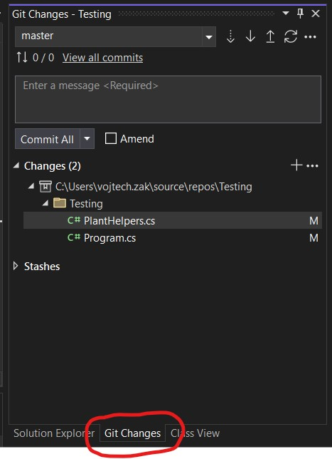
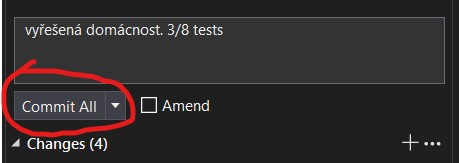

## Git

Je nástroj pro správu kódu a týmovou spolupráci při vývoji. Můžete si ho představit jako sdílený disk.

### Branch

Nebo-li větev je v git terminologii název pro kopii. Když si naklonujete řešení k sobě na počítač, zpravidla si naklonujete hlavní branch. `Main` nebo `Master` nejčastěji. Aktuální branch můžete vidět ve VS vpravo dole.

Kliknutím na `master` zde vytvořte novou branch. Jako název můžete použít Vaše jméno.

Po vytvoření by se změna měla projevit ve VS

Nyní jste vytvořili lokální kopii celé Solution. Každého jednoho souboru.

### Commit

Je v git terminologii název pro uložení změn. Je to stejné, jako když upravíte nějaký dokument a stisknete uložit. Rozdíl je v tom, že `commit` vyžaduje popis změn. Tomuto popisu se říká `commit message` a slouží k lepší přehlednosti.

Přepněte se do záložky `Git Changes` (Pokud znáte český překlad, prosím hoďte mi to do zpětné vazby. Díky)

Vidíte, že VisualStudio trackuje Vaše změny. Můžete si dvojklikem i zkontrolovat, co vše jste změnili. V pořádku? Zadejte `commit message`. Představte si, že ji píšete pro kolegu a měla by mu napovědět, co Vaše změny dělají.

