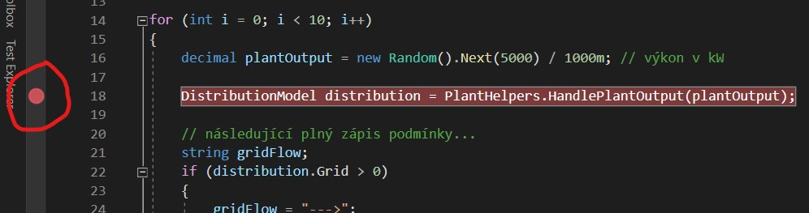
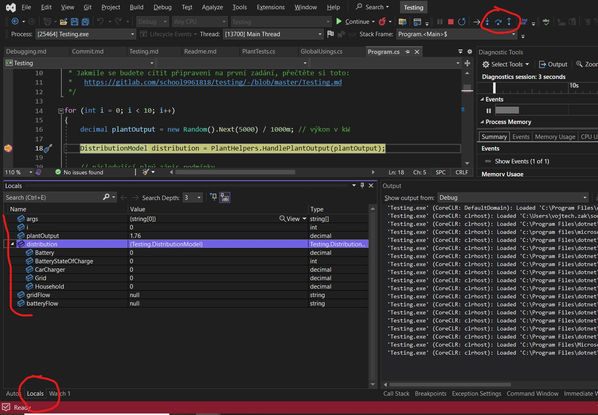
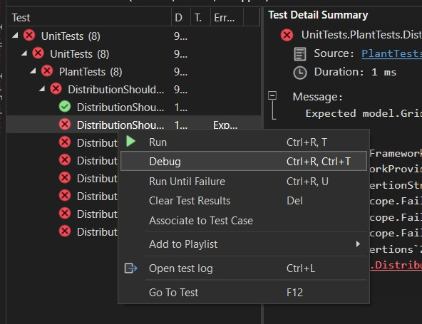

## Debugging

Je nástroj pro hledání chyb v programu.

### Visual Studio

Vytvořte breakpoint na libovolném příkazu kliknutím na lištu vlevo.

Když teď program spustíte, zastaví se na řádku označeném breakpointem.

Celý layout VS se změní. Dole doporučuji okno `locals` (lokální proměnné), kde vám automaticky VS trasuje Vaše proměnné. S pomocí šipek vpravo nahoře (F10, F11) si pak můžete krok po kroku procházet Vaším kódem.

### Debugging with tests

Další užitečná věc je, že jdou debugovat i testy. Pokud se Vám například nechce čekat, až simulace vygeneruje scénář, ve kterém je chyba, můžete si zdebugovat konkrétní test.

