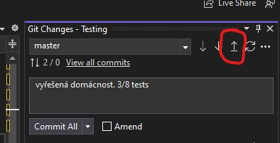
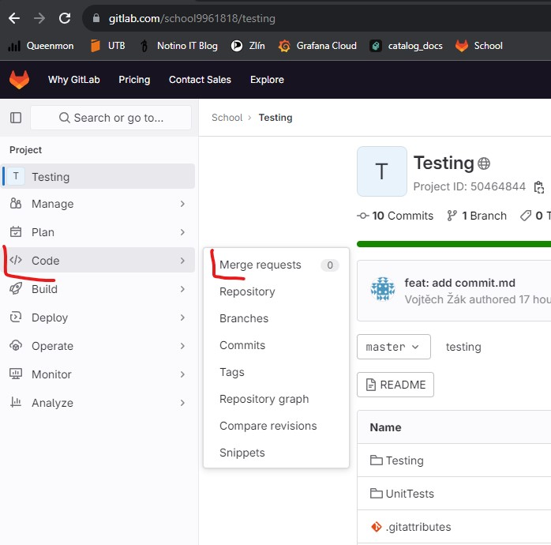
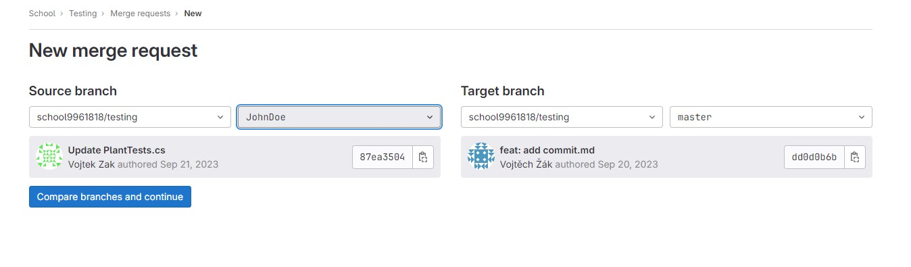

## Merge Request

Když vytvoříme novou kopii (branch) a uložíme do ní změny (commit), nezbývá než naše změny nahrát zpět do hlavní master větve. Tomu se říká `merge` (sloučení).

### Push

První musíme naše změny nahrát do cloudu (GitLab v našem případě). K tomu slouží příkaz `push` 

> Opakem je příkaz pull, který pro aktuální branch stáhne z cloudu nejnovější změny. I klonování, které používáme od začátku, je vlastně převlečený pull nad master větví.

### Merge Request

Když naši větev úspěšně nahrajeme do cloudu, můžeme založit `merge request` (žádost o sloučení). To uděláme přímo v GitLabu.

Na další stránce je možné upravit libovolné parametry (title, reviewer,...) a poté zascrollovat dolů

A to je zatím vše. Založením MR skončíme. V praxi je to zpravidla Váš kolega, který se na daný MR podívá, a pokud souhlasí, můžou se změny sloučit. Tak funguje spolupráce na vývoji s pomocí gitu.
