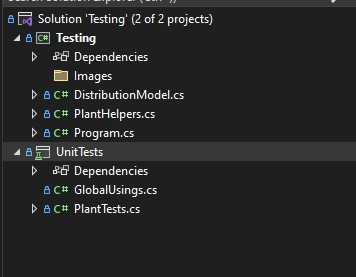
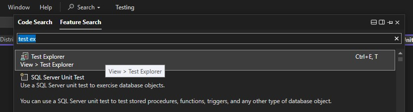
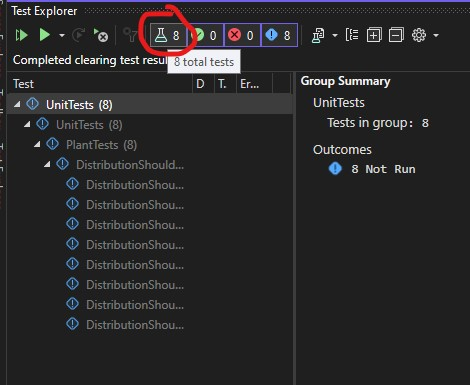
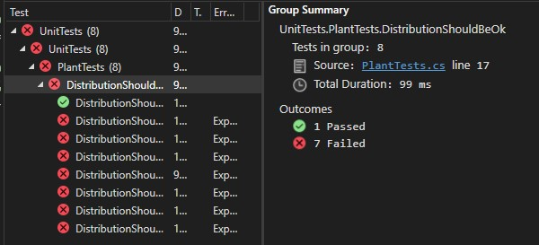


## Testing

Velmi užitečným nástrojem v programování je automatické testování.
Spouštět program pořád dokola a hledat chyby nebaví nikoho, a proto se začaly psát automatizované testy.

### Jak to funguje?

Napíši kód, který testuje jiný kód. Zní to jako zbytečnost, ale [rozhodně není](https://www.google.com/search?q=benefits+of+unit+testing). 

Testování dále dělíme podle zaměření:

A dnes si ukážeme, jak na **unit testy** ve Visual Studiu, 

### Unit test
Je takový test, který nepotřebuje nic ke svému provedení. Žádný internet, databázi, jiný program, nebo uživatelský vstup. Více odborně kdyžtak [zde](https://en.wikipedia.org/wiki/Unit_testing).

V Solution je vytvořený projekt určený pro unit testy

Dále existuje _Test Explorer_ (česky nejspíš průzkumník testů? Případně `ctrl + E,T`), který můžete otevřít přes vyhledávací okno nahoře ve VisualStudiu

Který automaticky prohledá celý Solution a testy hezky zobrazí.

Nyní můžeme testy spustit. Třeba zeleným vlevo nahoře nebo přes pravý click. Výsledek by měl vypadat takto.

To je v pořádku. Protože zprovoznit všechny failující testy bude Vaším úkolem v tomto cvičení. Projekt `UnitTests` a jeho soubory si určitě prohlédněte, ale žádné změny do něj nedělejte. Nyní se vraťte do Program.cs a pokračujte v zadání.